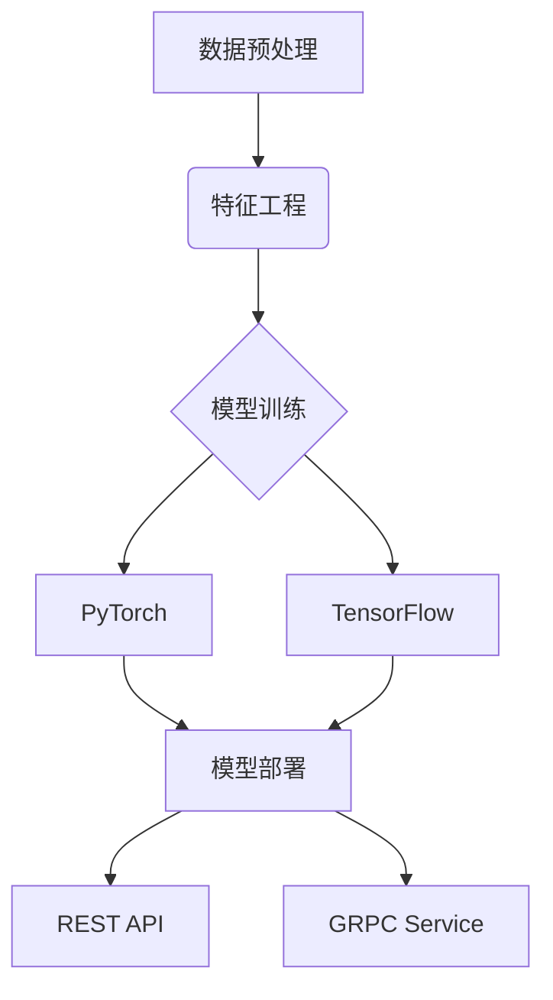

# 🧠 AI Project Repository

  
*(建议上传项目封面图替换此占位符)*


🚀 企业级AI解决方案框架，集成机器学习全流程与部署方案

## 📚 目录
- [特性亮点](#特性亮点-)
- [技术架构](#技术架构-)
- [快速入门](#快速入门-)
- [项目结构](#项目结构-)
- [开发指南](#开发指南-)
- [贡献规范](#贡献规范-)

## 特性亮点 🎯
- 🌈 多模态数据支持（文本/图像/语音）
- 🧩 模块化插件架构设计
- 🔄 TensorFlow/PyTorch双引擎自动切换
- 📊 实时训练监控看板（支持TensorBoard/WandB）
- 🚢 一键式Docker/K8s部署方案

## 技术架构 🛠


## 快速入门 🚦
```bash
# 克隆项目
git clone https://github.com/bbluo/ai-project.git
cd ai-project

# 安装依赖
pip install -r requirements.txt

# 启动训练 (示例)
python train.py --config configs/resnet50.yml
```

## 项目结构 📁
```
ai-project/
├── core/          # 核心算法实现
├── deploy/        # 部署方案
├── experiments/   # 实验记录
├── docs/          # 技术文档
├── web/           # 可视化界面
└── tests/         # 单元测试
```

## 开发指南 👨💻
- [代码规范](docs/CODESTYLE.md)
- [API文档](docs/API.md)
- [性能优化指南](docs/OPTIMIZATION.md)

## 贡献规范 🤝
欢迎参与贡献！请阅读[贡献指南](CONTRIBUTING.md)并遵循以下流程：
1. Fork本仓库
2. 创建特性分支 (`git checkout -b feature/AmazingFeature`)
3. 提交更改 (`git commit -m 'Add some AmazingFeature'`)
4. 推送分支 (`git push origin feature/AmazingFeature`)
5. 发起Pull Request

---

⭐️ **欢迎Star支持！如有任何问题请提交Issue**